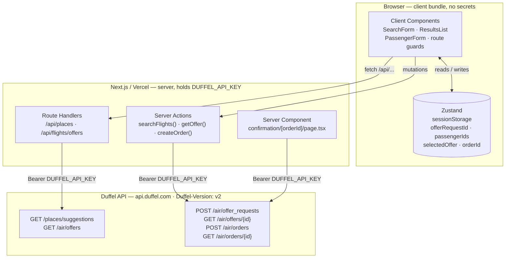
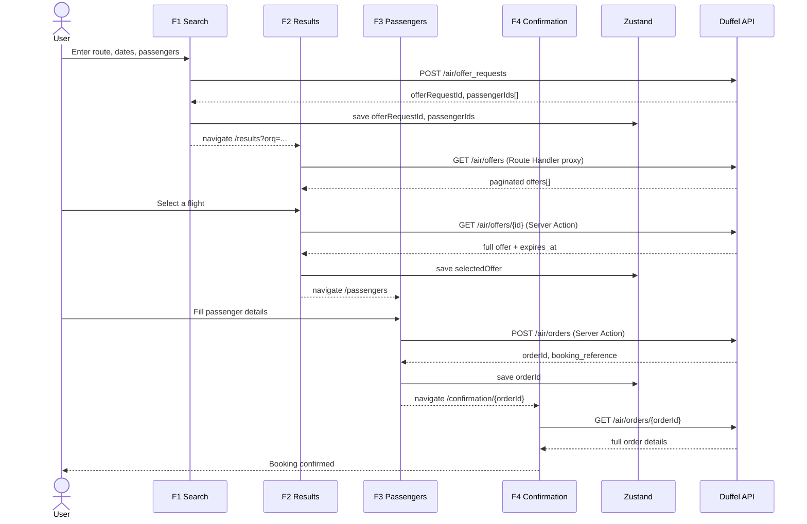
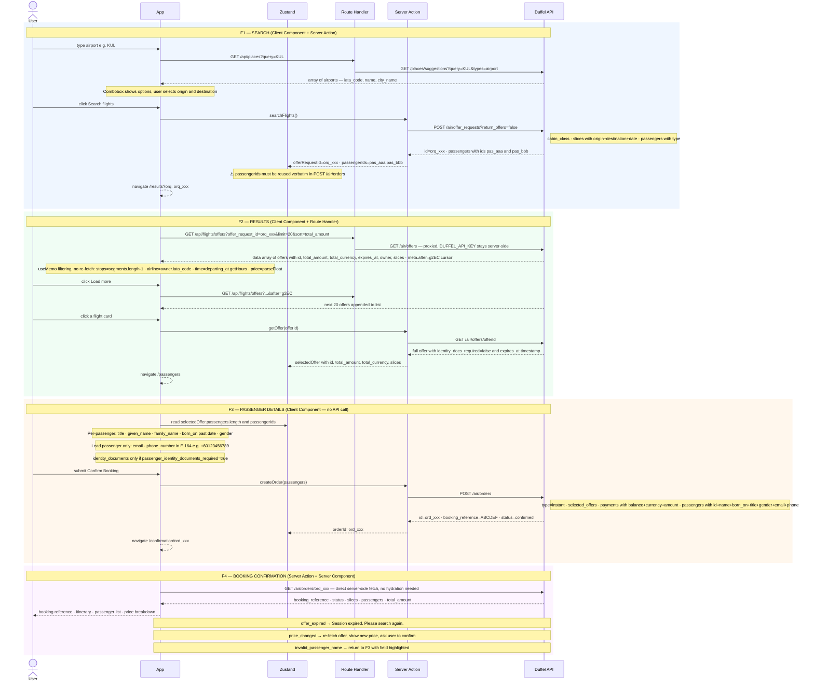
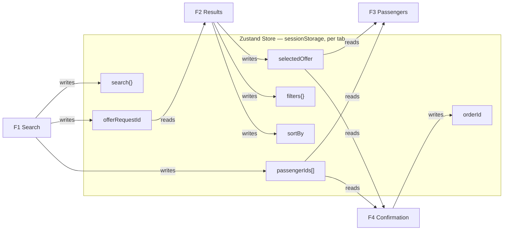
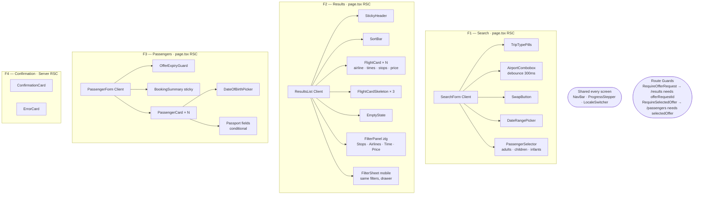

# Architecture — SkyBook Flight Booking

**Stack**: Next.js 16 App Router · React 19 · TypeScript · Tailwind CSS v4 · shadcn/ui · Zustand
**Deployment**: Vercel · **API**: Duffel REST v2

---

## Diagrams

### 1 — System Architecture

Who lives where, and what calls what. The `DUFFEL_API_KEY` only exists in the server layer.



---

### 2 — Booking Flow (step by step)

Every user action, API call, payload, response, and what gets stored.

**Overview:**



**Detailed breakdown — request and response specifics:**



---

### 3 — Zustand Store: What Each Screen Reads and Writes



---

### 4 — Component Tree (per screen)



---

## 1. Library Selection Rationale

Every dependency was chosen deliberately. This table documents the decision:

| Layer | Chosen | Rejected | Why chosen |
|-------|--------|----------|------------|
| **Framework** | Next.js 16 App Router | CRA, Vite+React | Required by assessment; App Router gives Server Components + Server Actions in one framework |
| **State** | Zustand v5 | Redux Toolkit, Jotai, Context | ~2KB bundle vs ~25KB Redux; single-store pattern suits a 4-screen linear flow; `persist` middleware built-in |
| **Forms** | React Hook Form + Zod | Formik, plain state | Uncontrolled forms = no re-render per keystroke; Zod schemas serve double duty (runtime validation + static types) |
| **UI** | shadcn/ui (Radix + Tailwind) | MUI, Chakra, Ant Design | Copy-paste ownership — no vendor lock-in; Radix provides combobox ARIA, focus management, keyboard navigation out of the box |
| **Styling** | Tailwind CSS v4 | CSS Modules, styled-components | Zero runtime; CSS-custom-property theming; pairs naturally with shadcn/ui |
| **Animation** | Framer Motion (`motion/react` v12) | CSS transitions only | Needed for list stagger + offer expiry guard; `LazyMotion` + `domAnimation` bundle keeps it ~7–9KB |
| **i18n** | next-intl | next-i18next, react-intl | Built specifically for App Router; server + client hooks; clean JSON message files |
| **Duffel access** | Raw `fetch` + custom wrapper | `@duffel/api` SDK | SDK is ~50KB; raw `fetch` wrapper is ~1KB; each call is readable without abstraction |
| **Data fetching** | Route Handlers + Server Actions | TanStack Query, SWR | Mutations need server-side auth (Server Actions); results need client-side filtering (Route Handlers proxy); TQ's client cache isn't needed |

**Why NOT TanStack Query**: Initially planned, but Server Actions eliminated the need. When mutations go through Server Actions, TQ's `useMutation` is redundant — you already have a typed server-side RPC call. For results, client-side filtering in a Zustand-driven `useMemo` replaces the need for TQ's cache entirely.

**Why NOT Duffel SDK**: The `@duffel/api` SDK adds ~50KB and wraps calls in SDK-specific abstractions that obscure error handling. A 30-line `duffelFetch<T>()` generic wrapper is transparent, debuggable, and produces zero bundle weight on the client.

---

## 2. Routing & Locale Strategy

**Decision**: `app/[locale]/` directory structure with next-intl.

**Why**:
- App Router enables Server Components, Server Actions, and streaming — critical for a fast booking flow.
- `[locale]` segment creates clean URLs (`/en/results`, `/ms/passengers`) without query parameters.
- next-intl chosen over next-i18next: built for App Router, simple JSON message files, no middleware overhead.
- Locale extracted from URL first, then request headers as fallback — confirmation pages are shareable as locale-specific deep links.

**Route structure**:
```
app/
├── [locale]/
│   ├── page.tsx                        ← F1: Search
│   ├── results/page.tsx                ← F2: Results
│   ├── passengers/page.tsx             ← F3: Passenger Details
│   ├── confirmation/[orderId]/page.tsx ← F4: Confirmation (Server Component)
│   └── layout.tsx
├── api/
│   ├── places/route.ts                 ← Airport autocomplete proxy
│   └── flights/offers/route.ts         ← Offers listing proxy
└── page.tsx (root redirect)
```

---

## 3. Rendering Strategy

**Decision**: Server Components for static screens and data fetching; Client Components for interactive filtering, sorting, and form handling.

| Screen | Strategy | Rationale |
|--------|----------|-----------|
| Search `/` | RSC layout + Client form | Form needs interactivity (combobox, date picker, live validation). Page shell is static. |
| Results `/results` | Hybrid | Server layout + Client `ResultsList`. Filtering/sorting require instant feedback without page reload. |
| Passengers `/passengers` | Client | Multi-field form with React Hook Form + real-time Zod validation. Requires full client context. |
| Confirmation `/confirmation/[orderId]` | Server Component | Async fetch at render time. No interactivity needed. Enables deep-link and page refresh. |

**Data fetching per operation**:

| Operation | Method | Why |
|-----------|--------|-----|
| Search (POST offer_request) | Server Action | Duffel token stays on server. Type-safe RPC. No client exposure. |
| Get single offer | Server Action | Auth token required; one-time fetch; result stored in Zustand. |
| List offers (GET air/offers) | Route Handler + client fetch | Client-side filter/sort needs the raw data without page reload. Proxy keeps token server-side. |
| Create booking (POST orders) | Server Action | Sensitive mutation — must be server-only. |
| Fetch confirmation | Server Component | Async RSC fetch — no hydration mismatch. Order already exists in Duffel. |

---

## 4. State Management

**Decision**: Zustand with `persist` middleware stored in `sessionStorage`.

**Store shape** (`lib/store.ts`):
```typescript
type BookingStore = {
  // Persisted — survives page reload, dies at tab close
  search: SearchInput | null;
  offerRequestId: string | null;   // ← from POST /air/offer_requests
  passengerIds: string[];           // ← MUST use verbatim in POST /air/orders
  selectedOffer: DuffelOffer | null;
  orderId: string | null;

  // Session-only — transient UI state
  filters: FilterState;
  sortBy: SortOption;
};
```

**Why sessionStorage, not localStorage**:
- **Tab isolation**: Multiple booking tabs get their own session. No cross-tab state pollution when comparing prices.
- **Security**: Passenger data (name, email, phone) dies when the tab closes — not persisted to disk.
- **UX**: Mobile users expect a fresh booking when they reopen the app; sessionStorage respects that expectation.

---

## 5. Server Actions for Mutations

**Decision**: Server Actions for all mutations; API Route Handlers only for client-side data fetching.

```
src/actions/
├── search.ts   → searchFlights()  → POST /air/offer_requests
├── offers.ts   → getOffer()       → GET  /air/offers/{id}
└── booking.ts  → createOrder()    → POST /air/orders
```

**Why Server Actions over API routes for mutations**:
- Duffel API key never leaves the server — no token in browser bundle or localStorage.
- Type-safe RPC: argument and return types are shared between client and server TypeScript.
- No accidental public endpoint exposure: Server Actions are implicitly server-scoped.

---

## 6. No Duffel SDK — Raw Fetch

**Custom wrapper** (`lib/duffel.ts`, marked `'server only'`):
```typescript
async function duffelFetch<T>(endpoint: string, options?: RequestInit): Promise<T> {
  const res = await fetch(`https://api.duffel.com${endpoint}`, {
    headers: {
      Authorization: `Bearer ${process.env.DUFFEL_API_KEY}`,
      'Duffel-Version': 'v2',
      'Content-Type': 'application/json',
    },
    ...options,
  });
  if (!res.ok) {
    const { errors } = await res.json();
    throw new DuffelError(errors[0]);
  }
  return res.json();
}
```

| Factor | SDK | Raw Fetch |
|--------|-----|-----------|
| Bundle | ~50KB | ~1KB |
| Readability | Abstracted | Call-by-call, explicit |
| API version | Tied to SDK release | `Duffel-Version` header in code |
| Error handling | SDK exceptions | Custom `DuffelError` class |

---

## 7. Route Guards — useHydrated Pattern

**Problem**: Zustand rehydrates from `sessionStorage` only after client-side mount. On the server, `offerRequestId` is always `undefined` — a naive redirect guard would always redirect during SSR.

**Solution**: `useHydrated()` hook defers the guard until after client hydration.

```typescript
// components/shared/RequireOfferRequest.tsx
export function RequireOfferRequest({ children }: { children: ReactNode }) {
  const { offerRequestId } = useBookingStore();
  const hydrated = useHydrated();

  if (!hydrated) return <SkeletonLayout />;  // Wait — don't redirect yet
  if (!offerRequestId) redirect('/');         // Now safe to check
  return children;
}
```

**Applied to**:
- `/results` → requires `offerRequestId` (user must have submitted a search)
- `/passengers` → requires `selectedOffer` (user must have selected a flight)

---

## Appendix: Full File Structure

```
src/
├── app/
│   ├── [locale]/
│   │   ├── page.tsx                        ← F1: Search
│   │   ├── results/page.tsx                ← F2: Results
│   │   ├── passengers/page.tsx             ← F3: Passengers
│   │   ├── confirmation/[orderId]/page.tsx ← F4: Confirmation
│   │   ├── api/
│   │   │   ├── places/route.ts
│   │   │   └── flights/offers/route.ts
│   │   └── layout.tsx
│   └── page.tsx
├── actions/
│   ├── search.ts
│   ├── offers.ts
│   └── booking.ts
├── components/
│   ├── search/     (SearchForm, AirportCombobox, DateRangePicker, PassengerSelector, TripTypePills, SwapButton, PopularDestinationsGrid)
│   ├── results/    (ResultsList, FlightCard, FlightCardSkeleton, FilterPanel, FilterSheet, SortBar, StickyHeader, EmptyState, hooks/useFilteredOffers)
│   ├── passengers/ (PassengerForm, PassengerCard, DateOfBirthPicker, BookingSummary, OfferExpiryGuard)
│   ├── confirmation/ (ConfirmationCard, ErrorCard)
│   ├── shared/     (NavBar, ProgressStepper, RequireOfferRequest, RequireSelectedOffer, AirlineLogo, StopBadge, LocaleSwitcher)
│   └── ui/         (shadcn/ui — Button, Input, Calendar, Combobox, Accordion, Sheet, Popover, Slider, ...)
├── lib/
│   ├── duffel.ts       ← duffelFetch<T> + DuffelError
│   ├── store.ts        ← Zustand store
│   ├── types/
│   │   ├── duffel.ts   ← DuffelOffer, DuffelSlice, DuffelSegment, DuffelOrder
│   │   ├── forms.ts    ← Zod schemas
│   │   └── actions.ts  ← ActionResult<T>
│   ├── hooks/useHydrated.ts
│   └── animations/     (tokens, variants, hooks)
├── messages/
│   ├── en.json
│   ├── ms.json
│   └── zh.json
└── navigation.ts
```

---

## Related Documents

| Document | Relationship |
| --- | --- |
| [docs/workflow.md](./workflow.md) | The 10-phase process that produced these decisions — Phase 6 (Architecture Gate) is where this document was locked |
| [docs/ai-tools.md](./ai-tools.md) | How AI helped with specific architectural calls: Server Actions vs Route Handlers, `useHydrated()`, sessionStorage vs localStorage |
| [docs/competitive-research.md](./competitive-research.md) | The design system tokens (colors, spacing, component sizes) were sourced from the 7-OTA competitor analysis |
| [plans/…/00-architecture.md](../plans/260315-1200-flight-booking-app/frontend/implementation-plans/00-architecture.md) | The original pre-implementation planning artifact that this document was built from |
| [README.md](../README.md) | Project setup, feature list, and deployment guide |
