# Development Workflow — SkyBook

This document describes the 10-phase process from reading the assessment to deploying the live application.

---

## Workflow Diagram

```mermaid
flowchart TD
    A["1 ── Brainstorm\nDecompose assessment\nIdentify screens, API, deliverables"]
    B["2 ── Competitor Research\n7 OTAs studied and scored\nSkyscanner selected as primary reference"]
    C["3 ── Tech Stack Research\nCompare: Zustand vs Redux vs Jotai\nRHF+Zod vs Formik\nshadcn/ui vs MUI"]
    D["4 ── API & Library Research\nLive-test all 6 Duffel endpoints\nMap TypeScript types from responses\nDiscover return_offers=false requirement"]
    E["5 ── Plan\nWrite 12 implementation plan files\nRouting, tokens, data layer,\nroute guards, animations, responsive"]
    F["6 ── Architecture Gate\nfrontend-architect reviews component\nhierarchy and rendering strategy\nComponent split locked before coding"]
    G["7 ── Implement\nPhase by phase:\nSearch → Results → Passengers → Confirmation\nServer Actions, Route Handlers, i18n"]
    H["8 ── Code Review\ncode-reviewer agent audits:\nTypeScript correctness\nAccessibility\nCode quality"]
    I["9 ── Test & Fix\nEnd-to-end booking flow tested\nEdge cases: expiry, price change,\nhydration mismatch, round-trip filters"]
    J["10 ── Deploy\nVercel deployment\nDUFFEL_API_KEY set in env vars\nLive URL verified end-to-end"]

    A --> B --> C --> D --> E --> F --> G --> H --> I --> J
```

---

## Phase-by-Phase Breakdown

### Phase 1 — Brainstorm

**Goal**: Understand exactly what needs to be built before any research begins.

**Activities**:
- Read the assessment in full; annotate every requirement
- Decompose into deliverables: 4 screens, Duffel API integration, documentation, deployment
- Identify unknowns: Which Duffel endpoints are needed? What state needs to persist across screens?
- Define "done" for each screen

**Output**: Requirements checklist; scope decisions (multi-city excluded from initial scope; focus on end-to-end flow over polish)

---

### Phase 2 — Competitor Research

**Goal**: Understand how production OTAs solve the same UX problems before designing anything.

**Activities**:
- Tested 7 platforms: Google Flights, Skyscanner, Expedia, AirAsia, Booking.com, Kayak, Trip.com
- Measured: load time, booking time, UX score (subjective 1–10), design style
- Verified feature presence per assessment requirement on each platform
- Identified patterns to adopt and patterns to deliberately avoid

**Key decision**: Skyscanner selected as primary design reference — full 4-screen flow, clean design, all required features verified present.

**Output**: `plans/.../4-research-ui-ux.md`, `plans/.../5-research-ui-ux-competitor-analysis.md`

See [competitive-research.md](./competitive-research.md) for the full analysis.

---

### Phase 3 — Tech Stack Research

**Goal**: Select libraries with clear rationale, not defaults.

**Activities**:
- State management comparison: Zustand vs Redux Toolkit vs Jotai vs React Context
- Form library comparison: React Hook Form vs Formik vs uncontrolled state
- UI component system: shadcn/ui vs MUI vs Chakra vs Ant Design
- Duffel access: raw fetch vs `@duffel/api` SDK

**Key decisions**:
- Zustand over Redux: ~2KB vs ~25KB; no boilerplate; `persist` middleware built-in
- React Hook Form + Zod: uncontrolled forms = no re-render per keystroke; Zod schemas double as runtime + static types
- shadcn/ui: Radix UI accessibility primitives, no vendor lock-in, copy-paste ownership
- Raw fetch: 98% smaller than SDK; each call readable and debuggable

**Output**: `plans/.../3-research-overview-frontend.md`

---

### Phase 4 — API & Library Research

**Goal**: Understand the Duffel API deeply before writing any integration code.

**Activities**:
- Live-tested all 6 Duffel endpoints used in the booking flow:
  - `GET /places/suggestions` — airport autocomplete
  - `POST /air/offer_requests?return_offers=false` — create search request
  - `GET /air/offers?offer_request_id=&limit=&sort=&after=` — paginated results
  - `GET /air/offers/{id}` — single offer with full details
  - `POST /air/orders` — create booking
  - `GET /air/orders/{id}` — fetch confirmation
- Mapped TypeScript interfaces from live response shapes
- Discovered critical constraint: round-trip offers return **1,638 results inline** by default — `return_offers=false` required
- Verified `passengerIds[]` must be stored from the offer request and used verbatim in the order payload

**Output**: `plans/.../2-duffel-api-exploration.md`

---

### Phase 5 — Plan

**Goal**: Produce detailed implementation plans before writing any production code.

**12 plan files written**:

| File | Content |
|------|---------|
| `00-architecture.md` | Component hierarchy, routing, data fetching strategy, rendering decisions |
| `00-wireframes.html` | Screen-by-screen layout wireframes |
| `01-tailwind-config.md` | Design tokens, color system, typography scale |
| `02-design-tokens.md` | CSS custom properties, Skyscanner-sourced token values |
| `03-shadcn-components.md` | Which shadcn/ui components to install and configure |
| `04-data-layer.md` | Duffel API integration, Server Actions, Route Handlers |
| `05-route-guards-persistence.md` | Zustand store shape, sessionStorage persistence, route guard pattern |
| `06-form-validation.md` | Zod schemas per passenger type, React Hook Form wiring |
| `07-layout-guide.md` | Responsive layout rules per screen |
| `08-round-trip.md` | Round-trip search and display implementation |
| `09-responsive-plan.md` | Mobile breakpoints, mobile-specific component variants |
| `10-animation-plan.md` | Motion tokens, stagger variants, `prefers-reduced-motion` handling |

**Output**: `plans/.../implementation-plans/`

---

### Phase 6 — Architecture Gate

**Goal**: Have the architecture reviewed and locked before implementation begins. This prevents expensive structural rework mid-implementation.

**Who**: `frontend-architect` agent (tri_ai_kit) reviewed the architecture plan.

**What was reviewed**:
- Component hierarchy: which components are Server Components, which are Client Components
- Rendering strategy per page: confirmed Server Component for Confirmation, hybrid for Results
- State management: Zustand store shape, what's persisted vs session-only
- Route guard pattern: `useHydrated()` approach for SSR safety
- Data fetching split: Server Actions for mutations, Route Handlers for client fetching

**What changed after review**:
- TanStack Query removed from the plan — architect confirmed Server Actions made it redundant
- `useHydrated()` pattern added — architect flagged the SSR hydration risk with Zustand guards

**Output**: Final `00-architecture.md` (locked)

---

### Phase 7 — Implement

**Goal**: Build all 4 screens following the locked architecture.

**Implementation order** (each depends on the previous):

1. **Foundation**: Project scaffold, Tailwind tokens, shadcn/ui components, Zustand store, `duffelFetch` wrapper, i18n setup
2. **F1 — Search**: `AirportCombobox` (Places API), `DateRangePicker`, `PassengerSelector`, `TripTypePills`, `SearchForm`, `searchFlights()` Server Action
3. **F2 — Results**: Route Handler proxy, `ResultsList`, `FlightCard`, `FlightCardSkeleton`, `FilterPanel`, `FilterSheet`, `SortBar`, `useFilteredOffers` hook
4. **F3 — Passengers**: `PassengerCard`, `PassengerForm`, `DateOfBirthPicker`, `BookingSummary`, `OfferExpiryGuard`, `createOrder()` Server Action
5. **F4 — Confirmation**: `ConfirmationCard`, `ErrorCard`, `page.tsx` as Server Component with direct Duffel fetch
6. **Shared**: `NavBar`, `ProgressStepper`, `RequireOfferRequest`, `RequireSelectedOffer`, `LocaleSwitcher`, error boundaries

**Output**: `src/` — 40+ components, 3 Server Actions, 2 Route Handlers, 3 locale message files

---

### Phase 8 — Code Review

**Goal**: Catch issues before testing — TypeScript, accessibility, code quality.

**Who**: `code-reviewer` agent (tri_ai_kit) audited the implementation.

**What was reviewed**:
- TypeScript strictness: no `any`, proper discriminated unions, correct Duffel type mappings
- Accessibility: ARIA labels on combobox, keyboard navigation, focus management, color contrast
- Code quality: no dead code, consistent naming, no prop drilling, server-only boundaries

**Output**: Issues list → fixed before testing phase

---

### Phase 9 — Test & Fix

**Goal**: Verify the end-to-end booking flow works in a real browser with real Duffel test API calls.

**Testing approach**:
- Full booking flow: Search → select flight → fill passenger details → confirm booking → view confirmation
- Edge cases: offer expiry (wait for expiry countdown), price change (rare but API can return it), back-navigation after booking
- Round-trip flow: both outbound and return displayed correctly on results and confirmation
- Mobile: filter drawer, sticky footer, responsive card layout
- i18n: locale switch persists through booking flow

**Bugs found and fixed**:

| Bug | Root cause | Fix | Commit |
|-----|-----------|-----|--------|
| Build errors after shadcn/ui component update | Import path mismatch in Tailwind v4 | Updated import paths | `3455eac` |
| Layout gaps in FlightCard on round-trip | CSS grid not accounting for two-slice stack | Fixed grid alignment | `c4a1ed8` |
| Hydration mismatch flash on `/results` | `RequireOfferRequest` rendering before Zustand rehydrated | Added `useHydrated()` check | `e2b25eb` |

---

### Phase 10 — Deploy

**Goal**: Verified working deployment on Vercel.

**Steps**:
1. Connected GitHub repository to Vercel
2. Set `DUFFEL_API_KEY` in Vercel environment variables (Settings → Environment Variables)
3. Triggered deployment via `git push origin master`
4. Verified live URL end-to-end: search → select → passenger form → booking confirmation

**Live URL**: https://sky-book.vercel.app

---

## Key Learnings

1. **Research before planning, plan before coding** — the 12 implementation plan files took ~20% of total time but prevented multiple expensive architectural decisions from being made incorrectly mid-implementation.

2. **Architecture gate catches expensive issues early** — the `useHydrated()` pattern and the removal of TanStack Query were both caught at the architecture gate, not during implementation.

3. **Live API testing is non-negotiable** — `return_offers=false` requirement was only discoverable through live testing, not documentation. The TypeScript types were more accurate from live responses than from docs.

4. **Competitor research influences concrete decisions** — the decision to use Skyscanner's color system (`#0770E3`), card sizing (52px inputs), and filter panel placement came directly from 7-OTA research, not from default choices.
